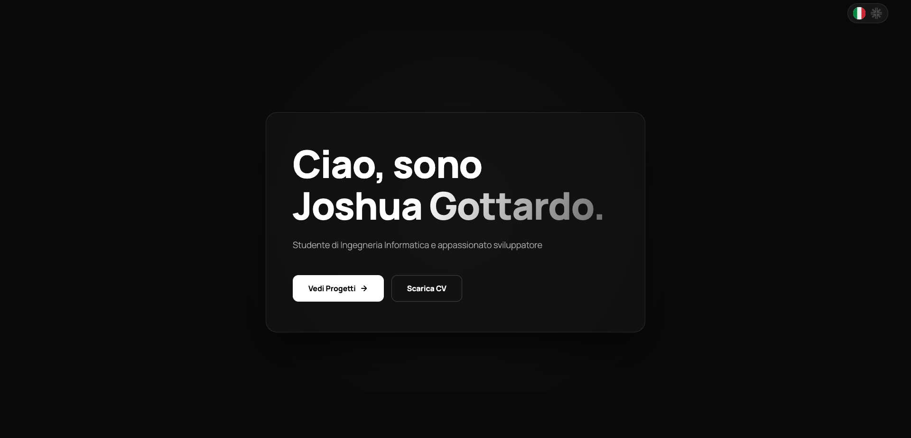

# Joshua Gottardo - Developer Portfolio

> A high-performance, immersive portfolio designed to showcase a 360° approach to Software Engineering, Business, and Strategy.



## 💡 About The Project

This portfolio is not just a showcase of projects; it is a statement of my engineering philosophy: **Maximum impact with minimal overhead.**

Instead of relying on heavy frameworks for a static site, I chose to architect this project using **Vanilla JavaScript** and modern CSS. This decision demonstrates a deep understanding of the DOM, browser rendering performance, and core web technologies.

**Key Objectives:**
* **Performance:** Achieving 100/100 Lighthouse scores across all metrics.
* **Experience:** Creating "wow" moments using physics-based animations (Tilt, Parallax).
* **Architecture:** Clean, semantic HTML and modular CSS without utility-class bloat.
* **Accessibility:** Fully navigable and semantic structure.

## 🛠 Tech Stack

* **Core:** HTML5, CSS3 (Custom Properties), Vanilla JavaScript (ES6+).
* **Animation Engine:** [GSAP](https://greensock.com/gsap/) (ScrollTrigger, Timeline).
* **Styling:** CSS Grid, Flexbox, Glassmorphism UI, Pure CSS Device Mockups.
* **Icons:** Simple Icons & Devicon (SVG).
* **Features:** Custom i18n (Internationalization) system for English/Italian toggle.

## ✨ Key Features

1.  **3D Interactive Hero:** A custom mouse-tracking tilt effect using GSAP physics.
2.  **Scrollytelling:** Text reveal animations synchronized with scroll position.
3.  **Horizontal Scroll Section:** A pinned horizontal gallery for skills, utilizing complex scroll-jacking techniques.
4.  **Infinite Marquee:** Seamless CSS-only looping animation for the tech stack.
5.  **Sticky Project Stack:** A stacking card effect for case studies, optimizing vertical space on desktop and adapting to "pop-out" layout on mobile.
6.  **Pure CSS Device Mockups:** Smartphones and Browsers rendered entirely in CSS (no heavy images) for project previews.

## 📂 Project Structure

```text
/
├── assets/          # Media files
├── index.html       # Semantic markup
├── style.css        # consolidated styles with responsive breakpoints
├── script.js        # GSAP logic and i18n translation engine
└── README.md        # Documentation